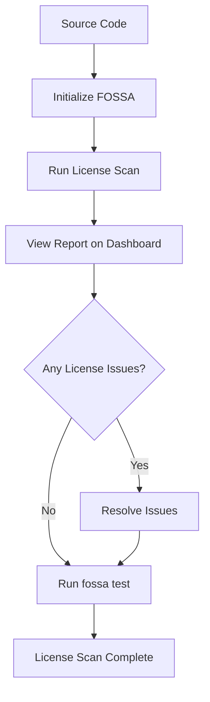

# **License Scanning Document**

  

## **Author Information**

| Created    | Last Updated | Version | Author       | Level           | Reviewer        |
| ---------- | ------------ | ------- | ------------ | --------------- | --------------- |
| 13-05-2025 | 13-05-2025   | V1      | Prince Batra | Internal Review | Siddharth Pawar |

---

## **Table of Contents**

* [Introduction](#introduction)
* [What is License Scanning?](#what-is-license-scanning)
* [Why Use License Scanning?](#why-use-license-scanning)
* [Workflow Diagram](#workflow-diagram)
* [Available Tools](#available-tools)
* [Tool Comparison](#tool-comparison)
* [Advantages vs Disadvantages](#advantages-vs-disadvantages)
* [Best Practices](#best-practices)
* [Recommendation](#recommendation)
* [License Scanning POC](#license-scanning-poc)
* [Conclusion](#conclusion)
* [Contact Information](#contact-information)
* [References](#references)

---

## **Introduction**

This document explains what license scanning is and why it is important. It helps teams automatically find open-source software licenses in their code and check if they are safe and legal to use. This guide also compares popular tools and recommends the most suitable one.

---

## **What is License Scanning?**

* License Scanning means checking software code for any open-source components and reading their license types.
* It helps make sure the licenses used are allowed by your company’s rules or legal policies.
* It scans files like `package.json`, `requirements.txt`, or other dependency files.
* The goal is to avoid using licenses that can cause legal or business problems.

---

## **Why Use License Scanning?**

* **Legal Safety**: Prevents using open-source licenses that are not allowed.
* **Better Security**: Some licenses come with risky conditions — scanning helps catch them early.
* **Quick Reviews**: Speeds up audits by automating license checks.
* **Policy Enforcement**: Stops code with restricted licenses from moving forward.
* **Full Visibility**: Lets teams know which open-source software is being used.

---

## **Workflow Diagram**

---

## **Available Tools**

* **FOSSA** – Easy to use and built for companies. Works well with CI/CD pipelines.
* **Black Duck (Synopsys)** – Powerful tool with advanced features for policy enforcement.
* **Snyk Open Source** – Good for developers and small teams; includes license checks.
* **ScanCode Toolkit** – Free and open-source; needs manual setup.
* **OSS Review Toolkit (ORT)** – Great for custom workflows; takes time to configure.

---

## **Tool Comparison**

| Feature            | FOSSA       | Black Duck  | Snyk          | ScanCode Toolkit | OSS Review Toolkit |
| ------------------ | ----------- | ----------- | ------------- | ---------------- | ------------------ |
| License Detection  | Yes         | Yes         | Yes           | Yes              | Yes                |
| Policy Enforcement | Yes         | Yes         | Basic         | No               | Yes                |
| Open Source        | No          | No          | Partial (CLI) | Yes              | Yes                |
| CI/CD Integration  | Strong      | Strong      | Easy          | Manual           | Good               |
| UI Dashboard       | Yes         | Yes         | Yes           | No               | Basic              |
| Ease of Use        | High        | Medium      | High          | Medium           | Medium             |
| Best For           | Enterprises | Enterprises | Small Teams   | Community Use    | Custom Workflows   |

---

## **Advantages vs Disadvantages**

| Tool       | Advantages                                    | Disadvantages                     |
| ---------- | --------------------------------------------- | --------------------------------- |
| FOSSA      | Easy to use, clear reports, good integrations | Paid only, not open-source        |
| Black Duck | Good for large companies with strict needs    | Expensive, complex to set up      |
| Snyk       | User-friendly, free tier, Git integration     | Limited control in free version   |
| ScanCode   | Fully open-source, flexible                   | Manual setup, takes time to learn |
| ORT        | Highly customizable                           | Complex for beginners             |

---

## **Best Practices**

| Area               | Practice                                                                |
| ------------------ | ----------------------------------------------------------------------- |
| Integration        | Add license scanning to your CI/CD pipeline to run on each code change. |
| Policy Definition  | Maintain a list of allowed and banned licenses.                         |
| Developer Training | Teach developers how to pick safe packages.                             |
| Automation         | Use automated alerts and build blockers for license issues.             |
| Regular Reviews    | Check license reports before releases.                                  |
| Tool Selection     | Pick tools that fit your project size and compliance needs.             |

---

## **Recommendation**

We recommend using **FOSSA** as the license scanning tool for our organization.

| Reason                     | FOSSA Advantage                                                   |
| -------------------------- | ----------------------------------------------------------------- |
| **Easy to Use**            | Simple to set up and manage even for new users                    |
| **Strong CI/CD Support**   | Integrates smoothly with Jenkins, GitLab CI, GitHub Actions, etc. |
| **Clear Reports**          | Provides easy-to-read license reports and compliance summaries    |
| **Policy Management**      | Lets you define and enforce licensing policies                    |
| **Developer-Friendly**     | Offers feedback during pull requests or builds                    |
| **Trusted by Enterprises** | Used by many companies for reliable license and security scanning |

---

## **License Scanning POC**

Refer to this link for "Step-by-Step Instructions" of the License Scanning Document.

---

## **Conclusion**

License scanning helps teams avoid legal and compliance problems when using open-source software. After comparing several tools, **FOSSA** is the best choice for our needs. It is easy to use, works well with our CI/CD systems, and gives detailed reports. Though it is a paid tool, the benefits and reliability it offers make it worth using, especially in enterprise environments.

---

## **Contact Information**

| Name         | Email Address                                                                     |
| ------------ | --------------------------------------------------------------------------------- |
| Prince Batra | [prince.batra.snaatak@mygurukulam.co](mailto:prince.batra.snaatak@mygurukulam.co) |

---

## **References**

| Title                 | Link                                                      | Purpose                    |
| --------------------- | --------------------------------------------------------- | -------------------------- |
| FOSSA Docs            | [Visit](https://docs.fossa.com/)                          | How to use FOSSA           |
| Synopsys Black Duck   | [Visit](https://www.synopsys.com/software-integrity.html) | Black Duck overview        |
| Snyk Documentation    | [Visit](https://docs.snyk.io/)                            | Guide for using Snyk       |
| ScanCode Toolkit Docs | [Visit](https://scancode-toolkit.readthedocs.io/)         | Guide for ScanCode         |
| OSS Review Toolkit    | [Visit](https://github.com/oss-review-toolkit/ort)        | Official ORT documentation |

