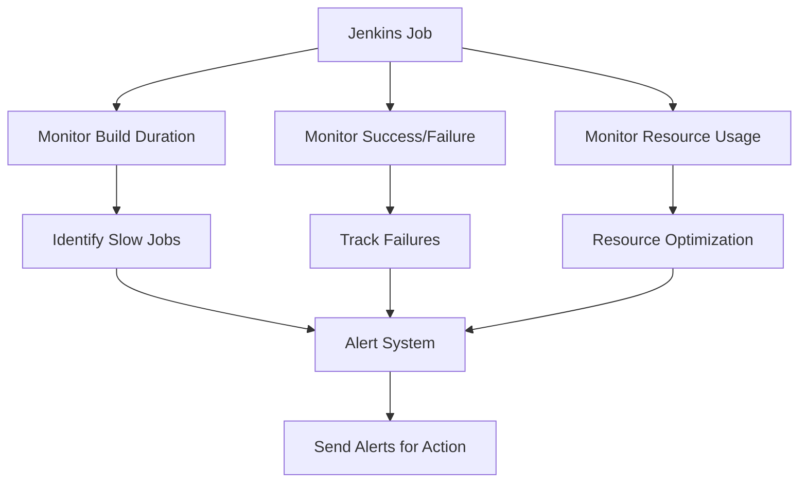

# **Jenkins Monitoring Metrics Documentation**

  

## **Author Information**

| Created    | Last Updated | Version | Author       | Level           | Reviewer        |
| ---------- | ------------ | ------- | ------------ | --------------- | --------------- |
| 15-05-2025 | 15-05-2025   | V1      | Prince Batra | Internal Review | Siddharth Pawar |
| 15-05-2025 | 15-05-2025   | V2      | Prince Batra | L0 Review       | Shikha          |
| 15-05-2025 | 15-05-2025   | V3      | Prince Batra | L1 Review       | Kirti Nehra     |

---

## **Table of Contents**

* [Introduction](#introduction)
* [What are Jenkins Monitoring Metrics?](#what-are-jenkins-monitoring-metrics)
* [Why Monitor Jenkins Metrics?](#why-monitor-jenkins-metrics)
* [Workflow Diagram](#workflow-diagram)
* [Types of Metrics to Monitor](#types-of-metrics-to-monitor)
* [Advantages vs Disadvantages](#advantages-vs-disadvantages)
* [Best Practices](#best-practices)
* [Conclusion](#conclusion)
* [Contact Information](#contact-information)
* [References](#references)

---

## **Introduction**

This document outlines the importance of monitoring Jenkins metrics, what metrics should be tracked, why they are critical for the CI/CD pipeline, and the best practices to implement them. Monitoring Jenkins helps optimize the development lifecycle, ensuring faster and more reliable builds.

---

## **What are Jenkins Monitoring Metrics?**

These metrics represent the key data points that help you monitor and analyze the performance of Jenkins jobs, nodes, and the overall CI/CD pipeline:

* **Job Success Rate** – Tracks the success vs failure of jobs, helping you spot recurring issues early.
* **Build Duration** – Measures the time it takes for a job to complete, which can highlight slow-running steps.
* **Queue Time** – Shows how long jobs wait before execution, helping you understand system load.
* **Agent Availability** – Monitors whether Jenkins agents are online and available, crucial for distributed systems.
* **Resource Usage** – Measures how much CPU and memory Jenkins is consuming, helping avoid overloading the system.

---

## **Why Monitor Jenkins Metrics?**

Monitoring these metrics ensures that Jenkins runs smoothly, offers performance insights, and helps you optimize your pipeline:

* **Performance Optimization** – Identifies bottlenecks or slow jobs that hinder build speed.
* **Early Issue Detection** – Helps in recognizing problems early in the development cycle, ensuring proactive fixes.
* **Improved Troubleshooting** – Data-driven insights aid in quicker identification and resolution of failures or errors.
* **Better Resource Management** – Monitoring resource usage helps in scaling Jenkins infrastructure according to demand.
* **Increased Reliability** – Tracking key metrics ensures the continuous availability of Jenkins, minimizing downtime and failure.

---

## **Workflow Diagram**

---

## **Types of Metrics to Monitor**

| **Metric Category** | **Metric Name**       | **Description**                                 |
| ------------------- | --------------------- | ----------------------------------------------- |
| **System Metrics**  | CPU Usage             | Tracks processor utilization on Jenkins nodes   |
|                     | Memory Usage          | Measures the memory consumption on Jenkins      |
| **Job Metrics**     | Build Duration        | Average time for job execution                  |
|                     | Job Success Rate      | Percentage of successful builds                 |
| **Queue Metrics**   | Job Queue Length      | Number of jobs waiting in the queue             |
|                     | Executor Availability | Number of available executors for job execution |
| **Plugin Metrics**  | Plugin Performance    | Tracks plugin load times and potential issues   |
|                     | Plugin Failures       | Number of plugin-related errors or issues       |

---

## **Advantages vs Disadvantages**

| **Advantages**                                                        | **Disadvantages**                                                                                    |
| --------------------------------------------------------------------- | ---------------------------------------------------------------------------------------------------- |
| Helps find slow jobs and performance issues, improving efficiency     | Setting up monitoring can be complicated and may require additional tools like Prometheus or Grafana |
| Detects problems early, reducing the time spent on fixing issues      | Monitoring tools can consume CPU and memory, slightly affecting system performance                   |
| Makes it easier to manage resources and scale Jenkins infrastructure  | False alerts may cause important notifications to be ignored                                         |
| Provides useful data for audits and meeting compliance standards      | Requires regular updates and maintenance to keep the monitoring system running smoothly              |
| Improves CI/CD processes by offering better insights into performance | Excessive data may overwhelm teams if not properly filtered, making it hard to focus on key issues   |

---

## **Best Practices**

| **Best Practice**              | **Description**                                                                                                                   |
| ------------------------------ | --------------------------------------------------------------------------------------------------------------------------------- |
| **Implement Alert Thresholds** | Set appropriate thresholds for critical metrics (e.g., build failures, job queue time) to trigger alerts only when necessary.     |
| **Automate Scaling**           | Use metrics like executor utilization and CPU load to automatically scale Jenkins nodes and executors based on workload.          |
| **Centralize Monitoring Data** | Use centralized monitoring tools (like Prometheus, Grafana) to aggregate data from multiple Jenkins instances for a unified view. |
| **Review Metrics Regularly**   | Periodically review Jenkins metrics to identify emerging patterns or issues that might not be immediately visible.                |
| **Optimize Build Times**       | Track and minimize build durations by analyzing job performance metrics and optimizing resource usage.                            |

---

## **Conclusion**

This document concludes that monitoring Jenkins metrics is essential for optimizing build efficiency, improving troubleshooting, and scaling Jenkins infrastructure effectively. It emphasizes the importance of tracking key metrics and following best practices to maintain a robust CI/CD pipeline.

---

## **Contact Information**

| Name         | Email Address                                                                     |
| ------------ | --------------------------------------------------------------------------------- |
| Prince Batra | [prince.batra.snaatak@mygurukulam.co](mailto:prince.batra.snaatak@mygurukulam.co) |

---

## **References**

| **Title**                         | **Link**                                                  |
|----------------------------------|-----------------------------------------------------------|
| Jenkins Official Monitoring Guide | [https://www.jenkins.io/doc/book/system-administration/monitoring/](https://www.jenkins.io/doc/book/system-administration/monitoring/) |
| Jenkins Metrics Plugin            | [https://plugins.jenkins.io/metrics/](https://plugins.jenkins.io/metrics/) |

