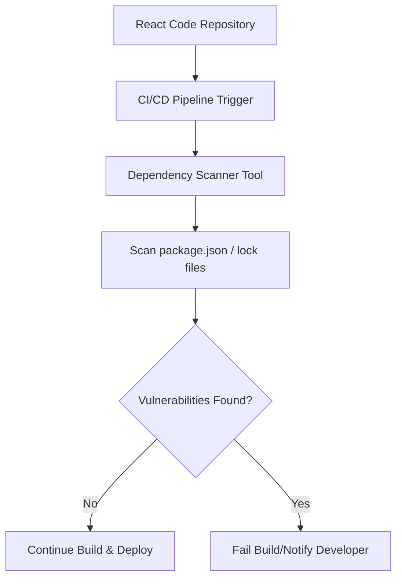

# **React CI: Dependency Scanning Document**

  

## **Author Information**

| Created    | Last Updated | Version | Author       | Level           | Reviewer        |
| ---------- | ------------ | ------- | ------------ | --------------- | --------------- |
| 14-05-2025 | 14-05-2025   | V1      | Prince Batra | Internal Review | Siddharth Pawar |
| 14-05-2025 | 14-05-2025   | V2      | Prince Batra | L0 Review       | Shikha          |
| 14-05-2025 | 14-05-2025   | V3      | Prince Batra | L1 Review       | Kirti Nehra     |

---

## **Table of Contents**

* [Introduction](#introduction)
* [What is Dependency Scanning?](#what-is-dependency-scanning)
* [Why Use Dependency Scanning?](#why-use-dependency-scanning)
* [Workflow Diagram](#workflow-diagram)
* [Available Tools](#available-tools)
* [Tool Comparison](#tool-comparison)
* [Advantages vs Disadvantages](#advantages-vs-disadvantages)
* [Best Practices](#best-practices)
* [Recommendation](#recommendation)
* [Dependency Scanning POC](#dependency-scanning-poc)
* [Conclusion](#conclusion)
* [Contact Information](#contact-information)
* [References](#references)

---

## **Introduction**

This document describes dependency scanning in the context of React applications. It explains how to detect vulnerable or outdated packages in real-time as part of CI workflows. The goal is to help teams maintain secure, up-to-date codebases with automation and minimal manual effort.

---

## **What is Dependency Scanning?**

* Dependency scanning is a method to automatically check the packages your application uses.
* It identifies outdated versions or known vulnerabilities in third-party libraries.
* Tools scan files such as `package.json` and `package-lock.json` in React projects.
* It is an important step to keep your code secure and compliant with security standards.

---

## **Why Use Dependency Scanning?**

* **Security Awareness**: Helps detect and fix known vulnerabilities before they reach production.
* **Faster CI/CD Pipelines**: Automates security checks during pull requests and deployments.
* **Improved Reliability**: Avoids broken builds due to incompatible or deprecated packages.
* **Compliance Support**: Assists with meeting industry security and compliance standards.
* **Developer Efficiency**: Gives fast feedback during code commits or merge requests.

---

## **Workflow Diagram**

---

## **Available Tools**

* **Snyk** – Widely used for JavaScript/React, integrates easily with GitHub and CI pipelines.
* **Dependabot** – GitHub-native; automatically raises PRs for outdated packages.
* **npm Audit** – Built into npm CLI; provides fast, local scans.
* **OWASP Dependency-Check** – General-purpose tool; good for enterprise-grade scanning.
* **WhiteSource Bolt** – Free version for GitHub, focused on open-source scanning.

---

## **Tool Comparison**

| Feature             | Snyk      | Dependabot   | npm Audit | OWASP Dep-Check | WhiteSource Bolt |
| ------------------- | --------- | ------------ | --------- | --------------- | ---------------- |
| React Support       | Yes       | Yes          | Yes       | Basic           | Yes              |
| Auto PR Creation    | Yes       | Yes          | No        | No              | Yes              |
| CI/CD Integration   | Strong    | GitHub Only  | CLI       | Medium          | Medium           |
| Vulnerability DB    | Strong    | GitHub       | npm       | CVE/NVD         | Medium           |
| Ease of Use         | High      | High         | Medium    | Medium          | Medium           |
| Free Tier Available | Yes       | Yes          | Yes       | Yes             | Yes              |
| Best For            | Dev Teams | GitHub Repos | CLI Users | Security Teams  | Small Teams      |

---

## **Advantages vs Disadvantages**

| Tool         | Advantages                            | Disadvantages                     |
| ------------ | ------------------------------------- | --------------------------------- |
| Snyk         | Easy to integrate, real-time feedback | Free version has usage limits     |
| Dependabot   | Auto-updates via PRs, GitHub native   | Limited to GitHub only            |
| npm Audit    | Fast and simple to run                | Lacks deep insights or policies   |
| OWASP DepChk | Open-source and widely trusted        | Requires manual setup and configs |
| WhiteSource  | Good scanning and reporting           | Limited control in free version   |

---

## **Best Practices**

| Area               | Practice                                                                |
| ------------------ | ----------------------------------------------------------------------- |
| Integration        | Run dependency scans during pull requests or merges in CI/CD.           |
| Update Strategy    | Regularly update packages using automated tools like Dependabot.        |
| Alerts             | Set up automated alerts for new high-severity vulnerabilities.          |
| Version Pinning    | Always pin versions in `package-lock.json` to avoid unexpected updates. |
| Developer Training | Educate devs on interpreting scan reports and remediating issues.       |
| Tool Selection     | Choose tools that match your workflow and security goals.               |

---

## **Recommendation**

We recommend using **Snyk** for dependency scanning in React CI Repository.

| Reason                     | Snyk Advantage                                                |
| -------------------------- | ------------------------------------------------------------- |
| **CI/CD Friendly**         | Smooth integration with Jenkins, GitHub Actions, GitLab CI    |
| **Real-Time Feedback**     | Identifies issues during development and code reviews         |
| **Auto PR Fixes**          | Suggests fixes or creates PRs to resolve vulnerabilities      |
| **Vulnerability Database** | Maintains an up-to-date and detailed vulnerability repository |
| **Developer-Oriented**     | Designed for fast developer feedback and use                  |

---

## **Dependency Scanning POC**

Refer to this link for "Step-by-Step Instructions" for integrating Snyk in React CI workflows.

---

## **Conclusion**

This document provided a detailed overview of dependency scanning in React CI workflows. After tool comparison, Snyk is recommended for its developer-friendly interface and CI/CD integration. It ensures secure and compliant use of open-source packages.

---

## **Contact Information**

| Name         | Email Address                                                                     |
| ------------ | --------------------------------------------------------------------------------- |
| Prince Batra | [prince.batra.snaatak@mygurukulam.co](mailto:prince.batra.snaatak@mygurukulam.co) |

---

## **References**

| Title            | Link                                                         | Purpose                          |
| ---------------- | ------------------------------------------------------------ | -------------------------------- |
| Snyk Docs        | [Visit](https://docs.snyk.io/)                               | Guide for using Snyk             |
| Dependabot       | [Visit](https://docs.github.com/en/code-security/dependabot) | GitHub Dependabot documentation  |
| npm Audit        | [Visit](https://docs.npmjs.com/cli/v9/commands/npm-audit)    | Official npm audit documentation |
| OWASP Dep-Check  | [Visit](https://jeremylong.github.io/DependencyCheck/)       | Official OWASP docs              |
