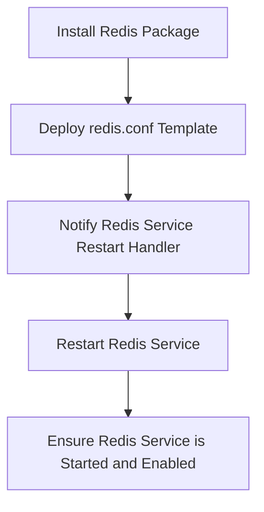

## Author Information

| Created    | Last updated | Version | Author       | Level           | Reviewer        |
| ---------- | ------------ | ------- | ------------ | --------------- | --------------- |
| 01-06-2025 | 01-06-2025   | V1      | Prince Batra | Internal Review | Siddharth Pawar |

---

## Table of Contents

- [Introduction](#introduction)
- [How to Create an Ansible Role](#how-to-create-an-ansible-role)
- [Directory Breakdown (with Purpose, Use Case, and Example)](#directory-breakdown-with-purpose-use-case-and-example)
- [Role Details](#role-details)
- [Directory Structure Explanation](#directory-structure-explanation)
- [Flow Diagram Requirements](#flow-diagram-requirements)
- [Contact Information](#contact-information)
- [Reference Table](#reference-table)

---

## 1. Introduction

This document details the Redis Ansible role, which automates installing and configuring the Redis server on Debian-based systems. It manages Redis installation, configuration deployment, and service control. The documentation follows a standard template for clarity and consistency.

---

## 2. How to Create an Ansible Role

For detailed instructions on creating an Ansible role, refer to the official guide:
[Click here](https://github.com/snaatak-Downtime-Crew/Documentation/blob/main/common_stack/ansible/roles/directory_structure/README.md#how-to-create-an-ansible-role)

---

## 3. Directory Breakdown (with Purpose, Use Case, and Example)

For detailed explanation of directory structures and their use cases, see:
[Click here](https://github.com/snaatak-Downtime-Crew/Documentation/blob/main/common_stack/ansible/roles/directory_structure/README.md#directory-breakdown-with-purpose-use-case-and-example)

## 4. Role Details

### Role Name

**redis** — This role installs the Redis server, deploys a customized Redis configuration, and ensures the Redis service is running and enabled on the target host.

### Requirements

* Target system should be Debian-based (e.g., Ubuntu), since this role uses `apt` package manager.
* Ansible must have necessary privileges (sudo) to install packages and manage services.
* No external dependencies or additional roles are required.

### Role Variables

The role defines default variables in `defaults/main.yml`:

* `redis_port`: The port on which Redis listens (default: 6379).
* `redis_bind`: The IP address Redis binds to (default: 127.0.0.1).

These variables can be overridden in the playbook or inventory as needed.

### Dependencies

No dependencies on other roles.

---

## 5. Directory Structure Explanation

The role follows this standard Ansible directory layout:

```
redis/
├── defaults/        # Default variables like redis_port, redis_bind (main.yml)
├── handlers/        # Service restart handler triggered on config changes (main.yml)
├── tasks/           # Installation, configuration, and service management tasks (main.yml)
├── templates/       # redis.conf Jinja2 template (redis.conf.j2)
├── files/           # Static files (empty for this role)
├── vars/            # Additional variables if required (empty)
├── meta/            # Role metadata such as author and dependencies (main.yml)
├── tests/           # Test playbooks (optional)
└── README.md        # Documentation (this file)
```

---

## 6. Flow Diagram Requirements

Below is the flow diagram of the main role steps:



---

## 7. Contact Information

| Name         | Email                                                                             |
| ------------ | --------------------------------------------------------------------------------- |
| Prince Batra | [prince.batra.snaatak@mygurukulam.co](mailto:prince.batra.snaatak@mygurukulam.co) |

---

## 8. Reference Table

| Links                                                                                                                | Overview                                                                   |
| -------------------------------------------------------------------------------------------------------------------- | -------------------------------------------------------------------------- |
| [Ansible Role Basics - Official Docs](https://docs.ansible.com/ansible/latest/user_guide/playbooks_reuse_roles.html) | Official documentation on Ansible roles and their reuse in playbooks.      |
| [Ansible Galaxy Roles Guide](https://galaxy.ansible.com/docs/contributing/creating_role.html)                        | Guide on creating and contributing roles on Ansible Galaxy.                |
| [Ansible Documentation](https://docs.ansible.com/)                                                                   | Official Ansible documentation for installation, configuration, and usage. |
