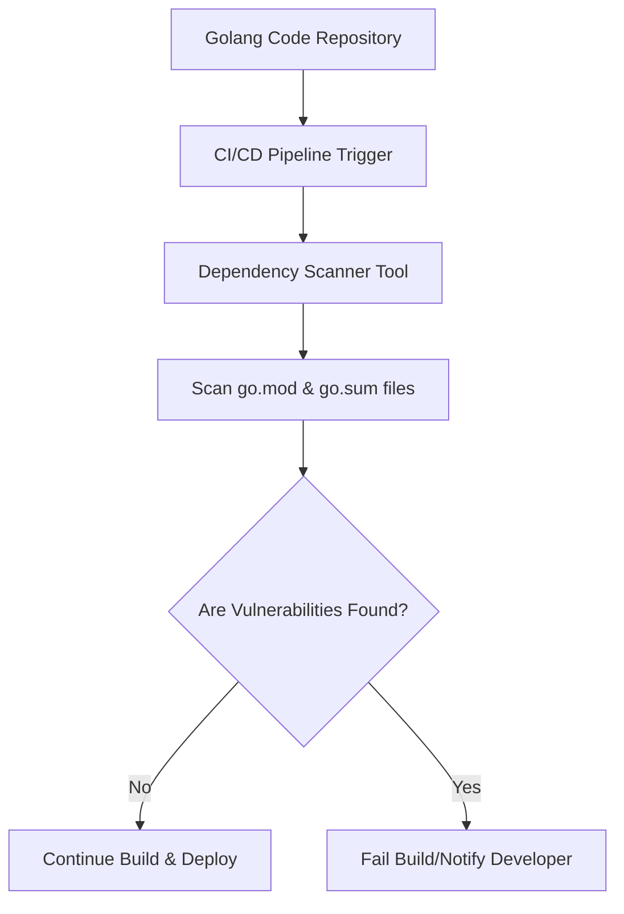

# **Golang CI: Dependency Scanning Document**

  

## **Author Information**

| Created    | Last Updated | Version | Author       | Level           | Reviewer        |
| ---------- | ------------ | ------- | ------------ | --------------- | --------------- |
| 17-05-2025 | 17-05-2025   | V1      | Prince Batra | Internal Review | Siddharth Pawar |
| 17-05-2025 | 17-05-2025   | V2      | Prince Batra | L0 Review       | Shikha          |
| 17-05-2025 | 17-05-2025   | V3      | Prince Batra | L1 Review       | Kirti Nehra     |

---

## **Table of Contents**

* [Introduction](#introduction)
* [What is Dependency Scanning?](#what-is-dependency-scanning)
* [Why Use Dependency Scanning?](#why-use-dependency-scanning)
* [Workflow Diagram](#workflow-diagram)
* [Available Tools](#available-tools)
* [Tool Comparison](#tool-comparison)
* [Advantages vs Disadvantages](#advantages-vs-disadvantages)
* [Best Practices](#best-practices)
* [Recommendation](#recommendation)
* [Dependency Scanning POC](#dependency-scanning-poc)
* [Conclusion](#conclusion)
* [Contact Information](#contact-information)
* [References](#references)

---

## **Introduction**

This document explains dependency scanning for Go (Golang) projects in CI pipelines. Dependency scanning helps find vulnerabilities and outdated modules automatically, ensuring Go applications are secure and reliable during build and deployment.

---

## **What is Dependency Scanning?**

* Dependency scanning detects vulnerabilities and outdated modules in Go projects.
* It scans `go.mod` and `go.sum` files to identify insecure or old dependencies.
* Tools compare dependencies against known vulnerability databases.
* This process is usually part of continuous integration workflows.

---

## **Why Use Dependency Scanning?**

* **Security:** Find and fix risky dependencies before deployment.
* **Automation:** Runs automatically as part of CI/CD pipelines.
* **Reliability:** Avoid using unsupported or vulnerable packages.
* **Compliance:** Helps meet security and audit standards.
* **Developer Awareness:** Gives quick feedback about risks in dependencies.

---

## **Workflow Diagram**

---

## **Available Tools**

* **GoSec** – Static code analysis focused on Go code and some dependency checks.
* **OWASP Dependency-Check** – Scans Go modules for known security problems.
* **GitHub Dependabot** – Automatically creates PRs to update vulnerable Go modules.
* **GoAudit** – Simple command-line tool to find outdated or risky Go modules.
* **CycloneDX** – Creates Software Bill of Materials (SBOM) for dependencies.
* **Trivy** – Fast scanner for containers and code, supports Go dependency scanning.

---

## **Tool Comparison**

| Feature            | GoSec       | OWASP Dependency-Check   | Dependabot   | GoAudit     | CycloneDX                | Trivy                      |
| ------------------ | ----------- | ------------------------ | ------------ | ----------- | ------------------------ | -------------------------- |
| Support for Go     | Strong      | Good                     | Yes          | Yes         | Yes                      | Yes                        |
| Automatic PRs      | No          | No                       | Yes          | No          | No                       | No                         |
| Integration in CI  | Medium      | Medium                   | GitHub Only  | Medium      | Medium                   | Strong                     |
| Vulnerability Data | Basic       | Known Security Databases | GitHub       | Medium      | Known Security Databases | Known Security Databases   |
| Easy to Use        | Medium      | Medium                   | High         | Medium      | Medium                   | High                       |
| Free Version       | Yes         | Yes                      | Yes          | Yes         | Yes                      | Yes                        |
| Best Use Case      | Code Checks | Detailed Security Scans  | GitHub Repos | Small Teams | Dependency Listings      | Containers & Code Scanning |

---

## **Advantages vs Disadvantages**

| Tool            | Advantages                                    | Disadvantages                                |
| --------------- | --------------------------------------------- | -------------------------------------------- |
| GoSec           | Lightweight, focused on Go code quality       | Limited checks on dependency vulnerabilities |
| OWASP Dep-Check | Detailed vulnerability scanning, good reports | Requires Java, some setup needed             |
| Dependabot      | Auto PR updates, easy for GitHub users        | Works only with GitHub repositories          |
| GoAudit         | Simple CLI tool for checking Go modules       | Fewer features compared to others            |
| CycloneDX       | Great for creating detailed dependency lists  | Needs extra tools to analyze the output      |
| Trivy           | Fast, scans code and containers               | May need adjustments for Go-specific scans   |

---

## **Best Practices**

| Area               | Practice                                                 |
| ------------------ | -------------------------------------------------------- |
| Integration        | Run scans on pull requests and merges in CI/CD pipelines |
| Updates            | Keep Go modules regularly updated                        |
| Automated Fixes    | Use Dependabot or manual updates to fix vulnerabilities  |
| Developer Training | Help developers understand scan reports and fix issues   |
| Version Locking    | Pin versions in `go.mod` to avoid unexpected updates     |
| Continuous Review  | Monitor scan reports frequently                          |

---

## **Recommendation**

We recommend **OWASP Dependency-Check** for Golang dependency scanning because it is reliable, generates detailed reports, and is easy to run from the terminal.

| Reason                        | OWASP Dependency-Check Advantage                     |
| ----------------------------- | ---------------------------------------------------- |
| **Easy to Run from Terminal** | Runs with simple commands and standard tools         |
| **Clear Reports**             | Creates HTML and JSON reports easy to understand     |
| **Good Vulnerability Data**   | Uses trusted public security databases               |
| **Works with CI Pipelines**   | Supports Jenkins, GitHub Actions, GitLab, and others |
| **Scans Go Dependencies**     | Checks `go.sum` files directly for insecure packages |

---

## **Dependency Scanning POC**

Refer to this link for **"Step-by-Step Instructions"** for integrating OWASP Dependency-Check in Golang CI workflows.

---

## **Conclusion**

This document covered dependency scanning for Golang CI workflows. After reviewing several tools, OWASP Dependency-Check is recommended for its reliability and ease of use. Using this tool helps keep dependencies secure and up to date.

---

## **Contact Information**

| Name         | Email Address                                                                     |
| ------------ | --------------------------------------------------------------------------------- |
| Prince Batra | [prince.batra.snaatak@mygurukulam.co](mailto:prince.batra.snaatak@mygurukulam.co) |

---

## **References**

| Title                  | Link                                                         | Purpose                           |
| ---------------------- | ------------------------------------------------------------ | --------------------------------- |
| OWASP Dependency-Check | [Visit](https://jeremylong.github.io/DependencyCheck/)       | Official OWASP tool documentation |
| Go Modules Guide       | [Visit](https://blog.golang.org/using-go-modules)            | Official Go module guide          |
| GoSec                  | [Visit](https://github.com/securego/gosec)                   | Go static code analyzer           |
| Dependabot Docs        | [Visit](https://docs.github.com/en/code-security/dependabot) | Guide for GitHub Dependabot       |
| CycloneDX              | [Visit](https://cyclonedx.org/)                              | Software Bill of Materials (SBOM) |
| Trivy                  | [Visit](https://aquasecurity.github.io/trivy/)               | Code and container scanning tool  |
