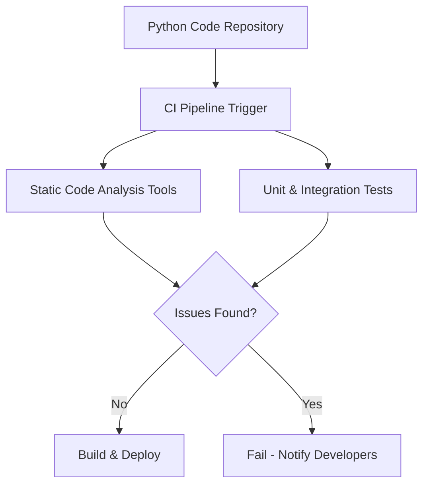

# **Python CI Checks Bugs Analysis Document**

  

## **Author Information**

| Created    | Last Updated | Version | Author       | Level           | Reviewer        |
| ---------- | ------------ | ------- | ------------ | --------------- | --------------- |
| 16-05-2025 | 16-05-2025   | V1      | Prince Batra | Internal Review | Siddharth Pawar |
| 16-05-2025 | 16-05-2025   | V2      | Prince Batra | L0 Review       | Shikha          |
| 16-05-2025 | 16-05-2025   | V3      | Prince Batra | L1 Review       | Kirti Nehra     |

---

## **Table of Contents**

* [Introduction](#introduction)
* [What is Python CI Bugs Analysis?](#what-is-python-ci-bugs-analysis)
* [Why Use Python CI Bugs Analysis?](#why-use-python-ci-bugs-analysis)
* [Workflow Diagram](#workflow-diagram)
* [Available Tools](#available-tools)
* [Tool Comparison](#tool-comparison)
* [Advantages vs Disadvantages](#advantages-vs-disadvantages)
* [Best Practices](#best-practices)
* [Recommendation](#recommendation)
* [Conclusion](#conclusion)
* [Contact Information](#contact-information)
* [References](#references)

---

## **Introduction**

This document provides an overview of Python Continuous Integration (CI) checks focused on bug detection and analysis. It outlines the importance of automated bug identification during CI workflows to ensure code quality, reliability, and faster development cycles in Python repositories.

---

## **What is Python CI Bugs Analysis?**

* Python CI bugs analysis involves automated tools and processes integrated into CI pipelines that detect bugs, errors, or code issues during code commits or pull requests.
* It includes static code analysis, linting, unit test execution, coverage checks, and security scanning.
* The goal is to catch bugs early before code merges or deployments.
* Common bug types detected include syntax errors, runtime exceptions, code smells, type errors, and security vulnerabilities.

---

## **Why Use Python CI Bugs Analysis?**

* **Early Bug Detection**: Identifies problems as soon as code is pushed, reducing debugging time later.
* **Improved Code Quality**: Enforces coding standards and detects common bugs or anti-patterns automatically.
* **Faster Feedback Loop**: Developers get immediate insights into the health of their code during pull requests.
* **Automated Testing**: Runs unit tests and integration tests continuously to prevent regressions.
* **Security Assurance**: Scans code for vulnerabilities and insecure patterns.
* **Reduced Production Failures**: Minimizes bugs making it to production by catching issues early in CI.

---

## **Workflow Diagram**

---

## **Available Tools**

* **Flake8** – Linter that checks style and programming errors based on PEP8 and other plugins.
* **Pytest** – Popular testing framework for unit, integration, and functional tests.
* **Bandit** – Security-oriented static analysis tool for Python source code.
* **Mypy** – Static type checker for Python, useful for detecting type-related bugs.
* **Pylint** – Comprehensive linter with configurable rules and reports.
* **SonarQube** – Platform that provides static code analysis, bug detection, and quality metrics.
* **GitHub Actions / Jenkins / GitLab CI** – Platforms to integrate and automate Python CI pipelines.

---

## **Tool Comparison**

| Tool      | Purpose                    | Ease of Setup | What It Detects           | Reporting        | Best Use Case                         |
| --------- | -------------------------- | ------------- | ------------------------- | ---------------- | ------------------------------------- |
| Flake8    | Code style and syntax      | Easy          | Style errors, syntax      | Console/CI logs  | Quick linting for style enforcement   |
| Pytest    | Unit and integration tests | Easy          | Test failures, exceptions | Console, reports | Automated test runs and bug catching  |
| Bandit    | Security analysis          | Medium        | Security vulnerabilities  | Console/CI logs  | Finding security issues in code       |
| Mypy      | Static type checking       | Medium        | Type errors               | Console/CI logs  | Catching type-related bugs            |
| Pylint    | Code analysis + linting    | Medium        | Style + code errors       | Console/CI logs  | Detailed linting and error reports    |
| SonarQube | Comprehensive code quality | Complex       | Bugs, vulnerabilities     | Web dashboard    | Enterprise-level code quality metrics |

---

## **Advantages vs Disadvantages**

| Tool      | Advantages                                        | Disadvantages                         |
| --------- | ------------------------------------------------- | ------------------------------------- |
| Flake8    | Easy to use, fast feedback on style & errors      | Limited to style & simple errors only |
| Pytest    | Highly extensible, supports fixtures & plugins    | Requires writing tests, extra effort  |
| Bandit    | Focused on security issues                        | May produce false positives           |
| Mypy      | Catches type errors before runtime                | Requires adding type hints to code    |
| Pylint    | Very configurable, detailed reports               | Can be verbose, sometimes noisy       |
| SonarQube | In-depth analysis, integrates with multiple tools | Setup complexity, resource intensive  |

---

## **Best Practices**

| Area              | Practice                                                                 |
| ----------------- | ------------------------------------------------------------------------ |
| Integration       | Run all CI checks (lint, tests, security scans) on every PR/commit.      |
| Incremental Setup | Start with basic tools (Flake8, Pytest), then add security/type checks.  |
| Test Coverage     | Enforce minimum coverage thresholds and fail builds if not met.          |
| Automation        | Automate bug reporting and notifications to developers immediately.      |
| Code Reviews      | Combine automated checks with manual peer reviews for quality assurance. |
| Documentation     | Document CI process and tools used, so all contributors are aligned.     |

---

## **Recommendation**

We recommend using **Pytest** for Python CI bugs analysis because it provides a balanced combination of simplicity, extensibility, and detailed bug detection.

| Reason               | Pytest Advantage                                              |
| -------------------- | ------------------------------------------------------------- |
| **Ease of Use**      | Simple to set up and run from the terminal                    |
| **Extensibility**    | Supports fixtures, plugins, and a wide ecosystem              |
| **Rich Reporting**   | Offers multiple reporting formats (console, JUnit XML, HTML)  |
| **Active Community** | Well-supported with frequent updates and a large user base    |
| **CI/CD Friendly**   | Integrates seamlessly with Jenkins, GitHub Actions, GitLab CI |
| **Fast Feedback**    | Runs tests quickly providing immediate feedback to developers |

---

## **Conclusion**

This document highlights key Python CI bug analysis tools and their role in catching bugs early. Integrating static analysis with testing ensures higher code quality and security. Pytest is recommended for its ease of use and strong testing capabilities, helping maintain reliable Python codebases.

---

## **Contact Information**

| Name         | Email Address                                                                     |
| ------------ | --------------------------------------------------------------------------------- |
| Prince Batra | [prince.batra.snaatak@mygurukulam.co](mailto:prince.batra.snaatak@mygurukulam.co) |

---

## **References**

| Tool      | Link                                                                                 | Purpose                            |
| --------- | ------------------------------------------------------------------------------------ | ---------------------------------- |
| Pytest    | [https://docs.pytest.org/en/stable/](https://docs.pytest.org/en/stable/)             | Python testing framework           |
| Flake8    | [https://flake8.pycqa.org/en/latest/](https://flake8.pycqa.org/en/latest/)           | Python style guide enforcement     |
| Bandit    | [https://bandit.readthedocs.io/en/latest/](https://bandit.readthedocs.io/en/latest/) | Security vulnerability scanner     |
| Mypy      | [http://mypy-lang.org/](http://mypy-lang.org/)                                       | Static type checker for Python     |
| Pylint    | [https://pylint.pycqa.org/en/latest/](https://pylint.pycqa.org/en/latest/)           | Code analysis and linting          |
| SonarQube | [https://www.sonarqube.org/](https://www.sonarqube.org/)                             | Code quality and security platform |
