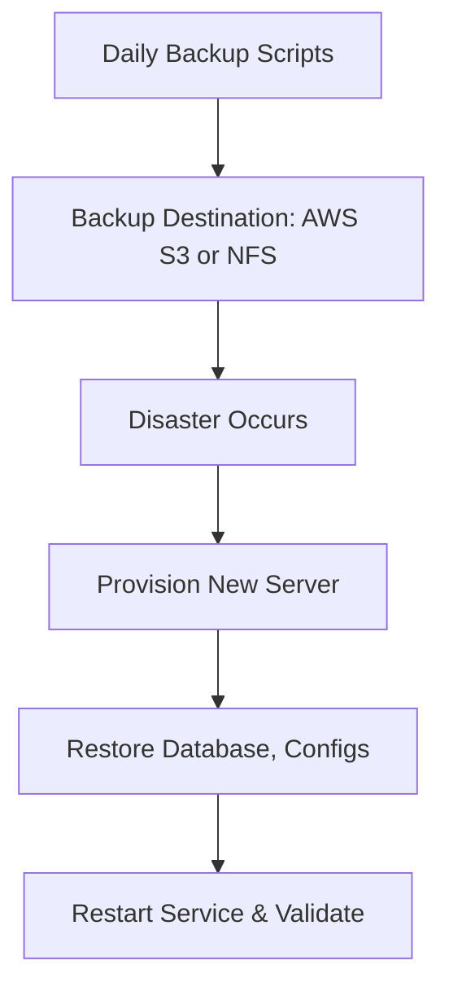

# **SonarQube Disaster Recovery (DR) Document**

<p align="center">
  
</p>

## **Author Information**

| Created    | Last Updated | Version | Author       | Level           | Reviewer        |
| ---------- | ------------ | ------- | ------------ | --------------- | --------------- |
| 16-05-2025 | 16-05-2025   | V1      | Prince Batra | Internal Review | Siddharth Pawar |
| 16-05-2025 | 16-05-2025   | V2      | Prince Batra | L0 Review       | Shikha          |
| 16-05-2025 | 16-05-2025   | V3      | Prince Batra | L1 Review       | Kirti Nehra     |

---

## **Table of Contents**

* [Introduction](#introduction)
* [What is Disaster Recovery in SonarQube?](#what-is-disaster-recovery-in-sonarqube)
* [Why is DR Important for SonarQube?](#why-is-dr-important-for-sonarqube)
* [Workflow Diagram](#workflow-diagram)
* [Backup Strategy](#backup-strategy)
* [Recovery Plan](#recovery-plan)
* [MTTR (Mean Time to Recovery)](#mttr-mean-time-to-recovery)
* [Tools and Methods](#tools-and-methods)
* [Advantages vs Disadvantages](#advantages-vs-disadvantages)
* [Best Practices](#best-practices)
* [Conclusion](#conclusion)
* [Contact Information](#contact-information)
* [References](#references)

---

## **Introduction**

This document outlines the Disaster Recovery (DR) strategy for SonarQube, focusing on backup procedures, recovery processes, and reducing Mean Time to Recovery (MTTR). It ensures data protection and service continuity during failures.

---

## **What is Disaster Recovery in SonarQube?**

Disaster Recovery in SonarQube includes:

* Backing up the **PostgreSQL database**
* Backing up **SonarQube configuration files**
* Preserving **plugins/extensions**
* Planning to **rebuild infrastructure** and restore SonarQube functionality in case of failure

---

## **Why is DR Important for SonarQube?**

* Ensures critical **code quality data is not lost**
* Reduces **CI/CD downtime**
* Maintains **audit and compliance history**
* Provides a **fallback plan** during upgrades or outages

---

## **Workflow Diagram**



---

## **Backup Strategy**

| **Component**        | **What to Back Up**                      | **Frequency**   | **Method**           |
| -------------------- | ---------------------------------------- | --------------- | -------------------- |
| PostgreSQL Database  | Project data, history, user info         | Daily           | `pg_dump`            |
| Configuration Files  | `sonar.properties`, `wrapper.conf`, etc. | On every change | `tar` archive        |
| Plugins & Extensions | Installed custom plugins                 | Weekly          | `rsync` or file copy |
| Logs (optional)      | For debugging                            | Rotating        | Archival tools       |

### **Commands**

```bash
# Backup PostgreSQL Database
pg_dump -U sonar -h localhost -Fc sonarqube > /backups/sonar_db_$(date +%F).dump

# Backup Configuration Files
tar -czvf /backups/sonar-config-$(date +%F).tar.gz /opt/sonarqube/conf

# Upload Backups to S3 (optional)
aws s3 cp /backups/ s3://my-sonarqube-backups/ --recursive
```

---

## **Recovery Plan**

1. Provision a server with the same OS and SonarQube version.
2. Install necessary dependencies (Java, PostgreSQL).
3. Install SonarQube and stop the service:

   ```bash
   systemctl stop sonarqube
   ```
4. Restore the PostgreSQL database:

   ```bash
   pg_restore -U sonar -h localhost -d sonarqube /backups/sonar_db_latest.dump
   ```
5. Restore configuration files:

   ```bash
   tar -xzvf /backups/sonar-config-latest.tar.gz -C /opt/sonarqube/conf/
   ```
6. Restore plugins (if backed up separately):

   ```bash
   rsync -av /backups/plugins/ /opt/sonarqube/extensions/plugins/
   ```
7. Start SonarQube and validate:

   ```bash
   systemctl start sonarqube
   ```

---

## **MTTR (Mean Time to Recovery)**

Mean Time to Recovery (MTTR) refers to the average time required to recover SonarQube services after a failure or incident. Below is a categorized estimate of recovery times for different types of failures:

### **Recovery Time Estimates by Scenario**

| **Scenario**                          | **Estimated MTTR**   |
| ------------------------------------- | -------------------- |
| Minor configuration issue             | Less than 30 minutes |
| Database-only recovery                | 1 to 2 hours         |
| Full environment rebuild with restore | 2 to 4 hours         |

### **Typical Recovery Timeline**

The following breakdown illustrates a realistic sequence and time estimate for full recovery (including provisioning and restoring a fresh SonarQube instance):

| **Recovery Step**                          | **Estimated Duration** |
| ------------------------------------------ | ---------------------- |
| Provision new server                       | 10–15 minutes          |
| Install Java and SonarQube                 | 15 minutes             |
| Restore PostgreSQL and configuration files | 30–60 minutes          |
| Service validation and restart             | 30 minutes             |

---

## **Tools and Methods**

| **Tool**     | **Purpose and Usage**                                               |
| ------------ | ------------------------------------------------------------------- |
| `pg_dump`    | Used to back up PostgreSQL database holding project and user data.  |
| `pg_restore` | Restores the database dump during recovery.                         |
| `tar`        | Archives and compresses config directories (`conf/`, etc.).         |
| `systemctl`  | Manages SonarQube service start/stop/status during restore process. |

---

## **Advantages vs Disadvantages**

| **Advantages**                                | **Disadvantages**                                    |
| --------------------------------------------- | ---------------------------------------------------- |
| Protects critical SonarQube analysis data     | Requires consistent backup verification              |
| Reduces CI/CD pipeline downtime               | Backup storage costs if using cloud                  |
| Ensures business continuity during failures   | Full DR simulations may be time-intensive            |
| Enables rollback in case of config corruption | DR steps must match versions (SonarQube, PostgreSQL) |
| Supports compliance and audit readiness       | Risk if any step is missed or misconfigured          |

---

## **Best Practices**

| **Best Practice**        | **Explanation**                                                   |
| ------------------------ | ----------------------------------------------------------------- |
| Automate Backups         | Use `cron` or Jenkins to schedule backups regularly               |
| Store Remotely           | Push all backups to S3/NFS to avoid single point of failure       |
| Version Compatibility    | Use same SonarQube + DB version when restoring                    |
| Document Recovery Steps  | Maintain runbooks with updated instructions for easy restoration  |
| Conduct Quarterly Drills | Practice the full DR process to ensure reliability under pressure |

---

## **Conclusion**

This document emphasizes the importance of consistent backups, well-defined recovery steps, and MTTR reduction to maintain SonarQube’s availability and data integrity. Implementing these practices minimizes disruption and supports reliable operations.

---

## **Contact Information**

| Name         | Email Address                                                                     |
| ------------ | --------------------------------------------------------------------------------- |
| Prince Batra | [prince.batra.snaatak@mygurukulam.co](mailto:prince.batra.snaatak@mygurukulam.co) |

---

## **References**

| **Title**                             | **Link**                                                                                                                                                                                                                                   |
| ------------------------------------- | ------------------------------------------------------------------------------------------------------------------------------------------------------------------------------------------------------------------------------------------ |
| SonarQube Backup and Restore Guide    | [https://docs.sonarsource.com/sonarqube-server/latest/server-upgrade-and-maintenance/maintenance/backup-and-restore/](https://docs.sonarsource.com/sonarqube-server/latest/server-upgrade-and-maintenance/maintenance/backup-and-restore/) |
| PostgreSQL Backup Guide (`pg_dump`)   | [https://www.postgresql.org/docs/current/app-pgdump.html](https://www.postgresql.org/docs/current/app-pgdump.html)                                                                                                                         |
