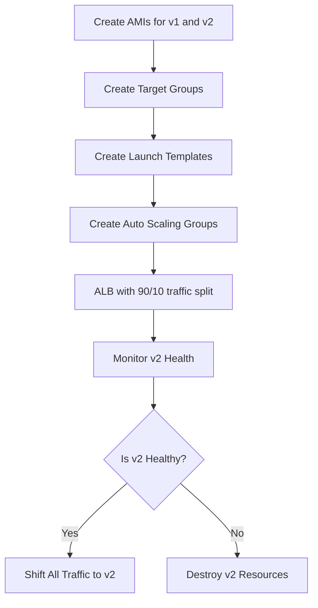

# Canary Deployment – Immutable Infra Rollout

<div align="center">
  
</div>

## **Author Information**

| Created    | Last updated | Version | Author       | Level           | Reviewer      |
| ---------- | ------------ | ------- | ------------ | --------------- | ------------- |
| 04-07-2025 | 04-07-2025   | V1.0    | Prince Batra | Internal Review | Komal Jaiswal |
| 04-07-2025 | 04-07-2025   | V1.0    | Prince Batra | L0 Review       | Shikha        |
| 04-07-2025 | 04-07-2025   | V1.0    | Prince Batra | L1 Review       | Kirti Nehra   |

---

## **Table of Contents**

1. [Introduction](#introduction)
2. [Flow Diagram](#flow-diagram)
3. [Terraform Approach](#terraform-approach)
4. [Canary Deployment Steps](#canary-deployment-steps)
5. [Conclusion](#conclusion)
6. [References](#references)

---

## Introduction

This document serves as a Proof of Concept (PoC) for implementing a Canary Deployment using Terraform. It demonstrates how infrastructure can be provisioned using Infrastructure as Code (IaC) to enable safe, staged rollouts of application updates.

---

## Flow Diagram



---

## Terraform Approach

### **Step-by-Step Infra Workflow**

1. **Create AMIs**

   * `ami_v1` → Application version v1
   * `ami_v2` → Application version v2

2. **Create Target Groups**

   * `canary-tg-v1` for v1 instances
   * `canary-tg-v2` for v2 instances

3. **Create Launch Templates**

   * `canary-lt-v1` → Uses `ami-v1`
   * `canary-lt-v2` → Uses `ami-v2`

4. **Create Auto Scaling Groups**

   * `canary-asg-v1` → Uses `canary-lt-v1`, size defined via `v1_count`
   * `canary-asg-v2` → Uses `canary-lt-v2`, size defined via `v2_count`
   * Both ASGs run in **public subnets**

5. **Create ALB and Listener**

   * One ALB with listener on port 80
   * Forwards traffic using weighted routing:

     * `canary-tg-v1`: 90%
     * `canary-tg-v2`: 10%

---

## Canary Deployment Steps

* Two ASGs: one for `v1`, one for `v2`


* Two target groups


* ALB with 90/10 traffic split


* The canary deployment serves v2 to a limited subset of users while maintaining v1 for most traffic, enabling safe incremental rollout.


* Monitor logs, metrics, health of `v2`, If healthy, adjust weights to shift traffic to `v2`

 
 
* If not, destroy `v2` ASG and TG

Rollback `v2`:

```bash
terraform destroy -target=aws_autoscaling_group.asg_v2 -target=aws_lb_target_group.tg_v2
```

---

## **Conclusion**

This document demonstrates a canary deployment using Terraform to safely roll out version v2 alongside v1. By routing 10% traffic to v2, issues can be identified early before full promotion. It ensures safer, controlled, and auditable infrastructure rollout.

---

## **Contact Information**

| Name         | Email Address                                                                     |
| ------------ | --------------------------------------------------------------------------------- |
| Prince Batra | [prince.batra.snaatak@mygurukulam.co](mailto:prince.batra.snaatak@mygurukulam.co) |

---

## **References**

| Title                          | Link                                                                                                                                                                             |
| ------------------------------ | -------------------------------------------------------------------------------------------------------------------------------------------------------------------------------- |
| Terraform AWS Provider         | [https://registry.terraform.io/providers/hashicorp/aws/latest/docs](https://registry.terraform.io/providers/hashicorp/aws/latest/docs)                                           |
| AWS Canary Deployment          | [https://docs.aws.amazon.com/codedeploy/latest/userguide/deployment-configurations.html](https://docs.aws.amazon.com/codedeploy/latest/userguide/deployment-configurations.html) |
| Canary Testing - Martin Fowler | [https://martinfowler.com/bliki/CanaryRelease.html](https://martinfowler.com/bliki/CanaryRelease.html)                                                                           |
